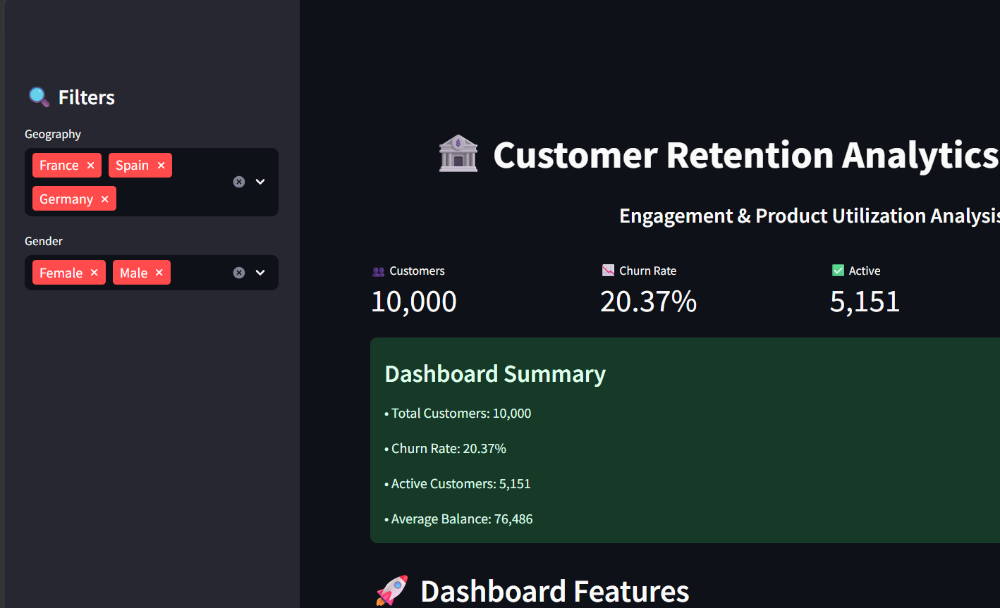
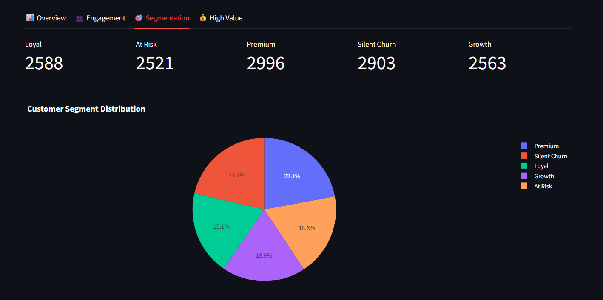
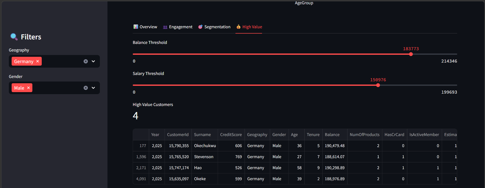

# 🏦 Customer Retention Analytics Dashboard

## 📌 Project Overview

Customer churn is a major challenge for banks, as losing existing customers can significantly impact profitability and customer acquisition costs. This project analyzes customer retention behavior using customer engagement, product utilization, and financial data to identify churn patterns and high-risk customer segments.

An interactive Streamlit dashboard was developed to provide business insights, customer segmentation, KPI monitoring, and retention analytics.

---

## 🎯 Project Objectives

* Analyze customer churn behavior.
* Evaluate the impact of customer engagement on retention.
* Study the relationship between product utilization and customer loyalty.
* Identify high-value but disengaged customers.
* Develop customer segmentation strategies.
* Create retention-focused business KPIs.
* Build an interactive analytics dashboard.

---

## 📊 Dataset Information

**Dataset:** European Bank Customer Dataset

**Records:** 10,000 Customers

### Features

* CustomerId
* Geography
* Gender
* Age
* CreditScore
* Tenure
* Balance
* NumOfProducts
* HasCrCard
* IsActiveMember
* EstimatedSalary
* Exited (Target Variable)

### Target Variable

* Exited = 0 → Customer Retained
* Exited = 1 → Customer Churned

---

## 🛠️ Technologies Used

* Python
* Pandas
* NumPy
* Matplotlib
* Seaborn
* Plotly
* Streamlit
* Jupyter Notebook

---

## 🚀 Dashboard Features

### 📈 Customer Churn Analysis

* Overall churn monitoring
* Churn distribution visualization

### 🌍 Geography Analysis

* Region-wise churn comparison
* Geography performance dashboard

### 👥 Engagement Analysis

* Engagement retention ratio
* Activity vs churn analysis

### 📦 Product Utilization Analysis

* Product depth index
* Product count vs churn rate

### 🎯 Customer Segmentation

* Loyal Customers
* At-Risk Customers
* Premium Customers
* Silent Churn Risk Customers
* Growth Opportunity Customers

### 💰 High-Value Customer Detector

* Balance threshold filtering
* Salary threshold filtering
* Premium customer identification

### ⚠️ Risk Analysis

* Customer risk classification
* Top at-risk customer detection

### 🔍 Customer Search

* Search customer details using Customer ID

### 📥 Data Export

* Download filtered customer data

---

## 📊 Key Performance Indicators (KPIs)

| KPI                             | Value  |
| ------------------------------- | ------ |
| Customer Churn Rate             | 20.37% |
| Engagement Retention Ratio      | 85.73% |
| Product Depth Index             | 1.54   |
| High-Balance Disengagement Rate | 49.05% |
| Credit Card Stickiness Score    | 79.82% |
| Relationship Strength Index     | 52.46  |

---

## 📌 Key Insights

* Customer engagement significantly improves retention.
* Customers using multiple products exhibit stronger loyalty.
* High account balances do not guarantee customer retention.
* Nearly half of high-balance customers are inactive.
* Older customers demonstrate higher churn tendencies.
* Geography influences customer retention behavior.
* Credit score has limited impact on customer churn.
* Credit card ownership is associated with stronger retention.

---

## Dashboard Screenshots

### Dashboard Home

### Customer Segmentation

### High Value Customer Detector

### Risk Analysis

---

## 💡 Business Recommendations

* Increase customer engagement initiatives.
* Promote multi-product adoption.
* Focus on high-value inactive customers.
* Implement loyalty and reward programs.
* Develop region-specific retention strategies.
* Strengthen customer relationship management.

---

## 📷 Dashboard Screenshots

(Add dashboard screenshots here)

---

## ▶️ How to Run

### Install Dependencies

pip install -r requirements.txt

### Run Dashboard

streamlit run app.py

---

## 📁 Project Structure

Customer_Retention_Project/

├── app.py

├── European_Bank.csv

├── Customer_Retention_Analytics.ipynb

├── requirements.txt

├── README.md

└── screenshots/

---

## 🔮 Future Scope

* Machine Learning-based Churn Prediction
* Real-Time Customer Monitoring
* AI-Powered Retention Recommendations
* Customer Lifetime Value Analysis
* Automated Risk Assessment

---

## 👩‍💻 Author

Mayuri Gupta

AI/ML Internship Project

Customer Retention Analytics: Engagement & Product Utilization Analysis
